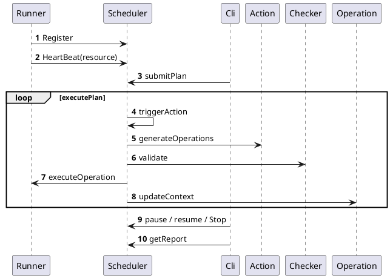
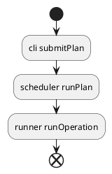

# verfier

## 框架

验证框架分为三个组件：scheduler ， runner ， cli

### 组件

#### scheduler

1.执行测试计划  
2.产生异常事件，现有的异常事件类型如下：

- 杀掉 master 进程
- 杀掉 worker 进程
- worker 目录不可写
- worker 磁盘 io hang
- cpu 高负载
- master 节点元数据损坏(随机测试模式不能执行这个 action ,在测试计划解析过程中直接报错)

3.监控集群资源状态，判断资源是否已经达到了最小可用集合

#### runner

1.监控节点资源状态，现有状态包括，master 进程是否存在，worker 进程是否存在以及磁盘是否可读写 和 io hang  
2.执行异常事件

#### cli

1. 查询当前测试环境各个资源状态
2. 暂停或者继续流程
3. 提交测试计划

### 设计和实现细节

#### 组件交互概要



#### 使用流程



#### cli 命令

usage : schedulerHost schedulerPort cmd args*

|command|args|description|
|:-----|:------|:--------|
|submit| xxx/plan.json | |
|stop|  | 停止执行计划运行，不回复集群状态，重置 scheduler 状态 |
|pause|  | 暂停执行计划，不重置 scheduler 状态 |
|resume|  | 恢复执行计划的执行 |
|report|  | 查询整体 scheduler 状态，包括了当前执行计划，以及各种资源列表 |

### 计划

测试计划是 json 格式，分成三种元素，分别是 action , trigger , checker。   
测试计划格式如下：

```json5
// 计划里面的所有简单 interval 的值都是时间字符串，不能直接输入数字
{
  "actions": [
    {
      "id": "xxx",
      // id 表示异常事件的类别
      "interval": "1s",
      // 当前 action 执行完成后，需要间隔的时间
      "selector": {
        "interval": "",
        // 一些 action 会有多个 operation ， interval 表示 operation 执行间的间隔
        "indices": [],
        // 表示具体的节点
        "device": [],
        // 表示节点相关的资源；如果 CPU ， workdir
      }
    }
  ],
  // trigger 有两种，分别是 random 和 sequence
  // interval 表示间隔，有两种间隔策略
  "trigger": {
    "policy": "random",
    "interval": {
      "type": "range",
      "start": "5s",
      "end": "15s"
    }
  },
  "checker": "resource",
  // random 场景下，必须配置一个 checker
  // sequence 模式下，不能配置  checker 

  "trigger": {
    "policy": "sequence",
    "interval": {
      "type": "fix",
      "value": "10s"
    },
    "repeat": "5",
    // 表示当前计划需要执行多少次，默认为1 
  }
}
```

#### 可用 action 列表

|id|description|restriction|
|:----|:----|:----|
|startworker| 启动 worker 进程 ||
|stopworker| 启动 worker 进程 ||
|startmaster| 启动 worker 进程 ||
|stopmaster| 启动 worker 进程 ||
|corruptdisk| 目录进入不可写状态 ||
|hangio| 模拟设备 iohang 住 ||
|resumedisk| 恢复目录到可写状态 ||
|resumeio| 去除设备 iohang 的状态 ||
|occupycpu| 抢占 cpu cores ||
|corruptmeta| 删掉 master ratis 原数据 | 不支持随机测试模式 |

#### 配置

verifier 使用了一个独立的配置文件 , 默认的配置文件名是 verifier.conf

| configration   |      default      |  description |
|:----------|:-------------|:------|
| verf.runner.test.mode |  false | true 会跳过节点资源检测过程 |
| verf.scheduler.address |  localhost:19097 |  |
| verf.scripts.master.start.script | $CELEBORN_HOME/sbin/start-master.sh |  |
| verf.scripts.master.stop.script | $CELEBORN_HOME/sbin/stop-master.sh |  |
| verf.scripts.worker.start.script | $CELEBORN_HOME/sbin/start-worker.sh |  |
| verf.scripts.worker.stop.script | $CELEBORN_HOME/sbin/stop-worker.sh |  |
| verf.block.bad.inflight.location | /root/badblock/inflight |  |
| verf.runner.timeout | 30s | runner 超时限制 |
| verf.runner.register.retry.delay | 5s | runner 注册重试时间 |
| verf.runner.heartbeat.delay | 30s | runner 心跳检查第一次延时时间 |
| verf.runner.heartbeat.interval | 30s | runner 心跳间隔 |
| verf.plan.action.selector.default.interval | 5s | action 的 selector 默认的interval |
| verf.plan.action.default.interval | 5s |  所有action 默认的 interval |

#### 打包

打包脚本

```bash
export MAKE_VERF=true;./dev/make-distribution.sh 
```

## 现有case

### 鲁棒性

触发各种异常（除了master meta 损坏），直到当前系统成为最小资源状态，然后逐步恢复，直到系统没有异常；循环下去;  
对于一个 n 个 master 节点 rss 集群来说， 最小可用资源是 （n/2+1） 个 master 节点存活， 2 个有 1 个磁盘可用的 worker 存在。   
结果验证方法：  
跑 1TB 的 tpc-ds , 在这个过程中 tpc-ds 应该执行能够成功执行完成，并且结果正确。

#### 测试计划文件

```json
{
  "actions": [
    {
      "id": "startworker",
      "interval": 1,
      "selector": {
        "type": "random"
      }
    },
    {
      "id": "stopworker",
      "interval": 1,
      "selector": {
        "type": "random"
      }
    },
    {
      "id": "startmaster",
      "interval": 1,
      "selector": {
        "type": "random"
      }
    },
    {
      "id": "stopmaster",
      "interval": 1,
      "selector": {
        "type": "random"
      }
    },
    {
      "id": "corruptdisk",
      "interval": 1,
      "selector": {
        "type": "random"
      }
    },
    {
      "id": "hangio",
      "interval": 1,
      "selector": {
        "type": "random"
      }
    },
    {
      "id": "resumedisk",
      "interval": 1,
      "selector": {
        "type": "random"
      }
    },
    {
      "id": "resumeio",
      "interval": 1,
      "selector": {
        "type": "random"
      }
    },
    {
      "id": "occupycpu",
      "duration": "30s",
      "cores": 5,
      "selector": {
        "type": "random"
      }
    }
  ],
  "trigger": {
    "policy": "random",
    "interval": {
      "type": "range",
      "start": "5s",
      "end": "15s"
    }
  },
  "checker": "resource"
}
```

### 预定义

1.主节点异常：  
master 节点一台或者两台发生异常，每次挂掉半分钟。  
2.worker 节点异常：  
worker 节点一台或者两台，每次挂掉半分钟。  
3.磁盘异常  
随机选择一个 worker ，测试一个磁盘，二个磁盘，全部磁盘不可写。  
4.磁盘 io hang 住  
随机选择一个 worker， 测试一个磁盘，二个磁盘，全部磁盘 io hang。  
5.master 元数据异常：  
master 节点异常的情况下，选择其中一台或者两台。   
结果验证方法：  
跑一个会持续数分钟的 query ， 这个 query 在大多数情况下成功运行;特定情况下允许失败

#### 测试计划文件

```json5
{
  "actions": [
    {
      "id": "stopmaster",
      "selector": {
        "indices": [
          1,
          2
        ]
      },
      "interval": 30
    },
    {
      "id": "startmaster",
      "selector": {
        "indices": [
          1,
          2
        ]
      },
      "interval": 30
    },
    {
      "id": "stopmaster",
      "selector": {
        "indices": [
          2,
          3
        ]
      },
      "interval": 30
    },
    {
      "id": "startmaster",
      "selector": {
        "indices": [
          2,
          3
        ]
      },
      "interval": 30
    },
    {
      "id": "stopmaster",
      "selector": {
        "indices": [
          2,
          3
        ]
      },
      "interval": 30
    },
    {
      "id": "corruptmeta",
      "selector": {
        "indices": [
          2,
          3
        ]
      },
      "interval": 30
    },
    {
      "id": "startmaster",
      "selector": {
        "indices": [
          2,
          3
        ]
      },
      "interval": 30
    },
    {
      "id": "stopworker",
      "selector": {
        "indices": [
          1,
          2
        ]
      },
      "interval": 30
    },
    {
      "id": "startworker",
      "selector": {
        "indices": [
          1,
          2
        ]
      },
      "interval": 30
    },
    {
      "id": "corruptdisk",
      "selector": {
        "indices": [
          1,
          2
        ],
        "device": [
          1,
          2
        ]
      },
      "interval": "120s"
    },
    {
      "id": "resumedisk",
      "selector": {
        "indices": [
          1,
          2
        ],
        "device": [
          1,
          2
        ]
      }
    },
    {
      "id": "hangio",
      "selector": {
        "indices": [
          1,
          2,
          3
        ],
        "device": [
          1,
          2,
          3
        ]
      },
      "interval": "120s"
    },
    {
      "id": "resumeio",
      "selector": {
        "indices": [
          1,
          2,
          3
        ],
        "device": [
          1,
          2,
          3
        ]
      }
    },
    {
      "id": "occupycpu",
      "duration": "30s",
      "cores": "8",
      "selector": {
        "indices": [
          1,
          2
        ]
      }
    }
  ],
  "trigger": {
    "policy": "sequence",
    "interval": {
      "type": "fix",
      "value": "10s"
    },
    "repeat": "5"
  }
}
```
